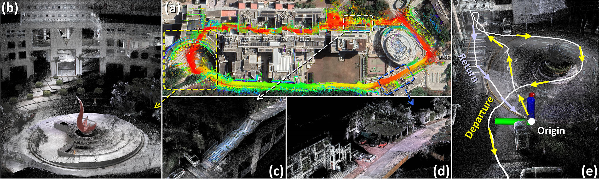
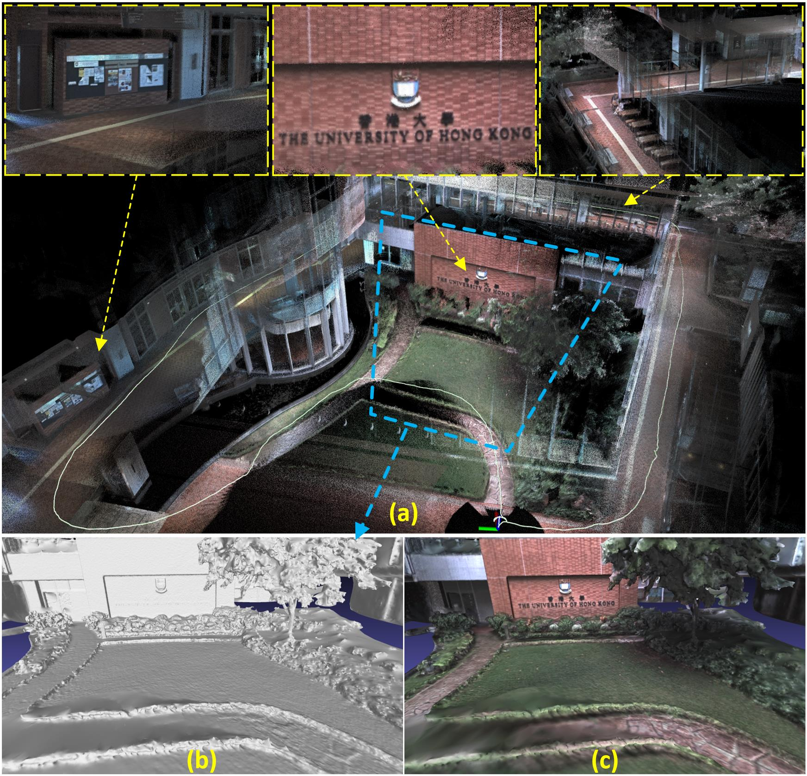

# r3live_preview
## Introduction
&emsp;This page shown more visualization results of our related paper **''R$^3$LIVE: A Robust, Real-time, RGB-colored, LiDAR-Inertial-Visual tightly-coupled state Estimation and mapping package''** ([arxiv](https://arxiv.org/abs/2109.07982), [github](https://github.com/hku-mars/r3live)), with providing the download the offline maps of our experiment result:

### Offline map of our Experiment-2
&emsp;The offline pointcloud maps ([hkust_campus_pointcloud.pcd](https://drive.google.com/file/d/1Mh2117Eir1GE5Sd_SaQlrNG6yJ6Ydv3t/view?usp=sharing)) of our Experiment-2 can be download on our [**google-drive**](https://drive.google.com/drive/folders/1UTV5QtFkkgjN6l17tXTboTMWbKPY3llJ?usp=sharing):
<div align="center">
<a href="https://youtu.be/j5fT8NE5fdg?t=104" target="_blank">
<font color=#a0a0a0 size=2>Our Experiment-2.</font>
</a>
</div>

### Our reconstructed mesh of HKU_Campus
More over, we also provide the offline pointcloud maps ([hku_demo_pointcloud.pcd](https://drive.google.com/file/d/1MewJjVoQA8SiOIREig4T0nrlwmTukobJ/view?usp=sharing)) and mesh ([hku_demo_mesh.ply](https://drive.google.com/file/d/1XjgmxTppXiIhCP52IUanp1rD4GMzrjKf/view?usp=sharing)) of HKU campus(see our relative [video](https://youtu.be/j5fT8NE5fdg?t=291)):

<div align="center">
<a href="https://youtu.be/j5fT8NE5fdg?t=291" target="_blank">
<font color=#a0a0a0 size=2>Build The University of Hong Kong with R3LIVE.</font>
</a>
</div>


## How to open?
For our offline pointcloud maps (with suffix **.ply*), you can open it with pcl_viewer, [CloudCompare](https://www.danielgm.net/cc/), and etc:
```
sudo apt-get install meshlab
pcl_viewer YOUR_DOWNLOADED_MAP.ply
```

For our offline mesh file, you can open it with [meshlab](https://www.meshlab.net/), [CloudCompare](https://www.danielgm.net/cc/), and etc:
```
sudo apt-get install pcl-tools 
pcl_viewer YOUR_DOWNLOADED_MAP.ply
```